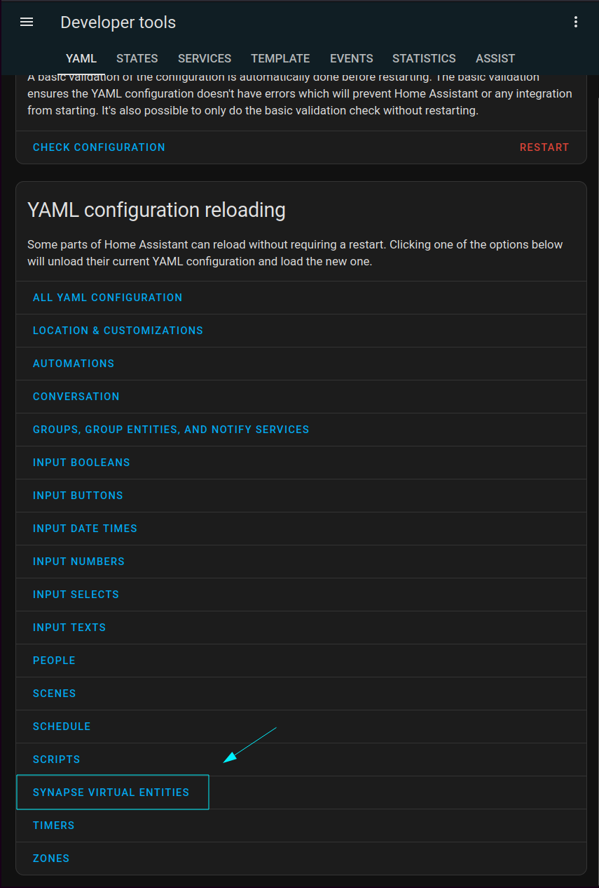

## 📘 Description

Welcome to `@digital-alchemy/synapse`!

This project builds on the functions provided by `@digital-alchemy/hass` to provide the ability to generate entities within your Home Assistant install. With the help of a [custom component](https://github.com/Digital-Alchemy-TS/synapse-extension), you can gate logic behind switches, report states with sensors, attach functions to buttons, and more!

## 💾 Install

You can install the custom component through HACS. See the repo for more detailed install instructions of the component: https://github.com/Digital-Alchemy-TS/synapse-extension

This library can be installed as a simple dependency
```bash
npm i @digital-alchemy/synapse
```
> Requires [@digital-alchemy/hass](https://github.com/Digital-Alchemy-TS/hass)!

## 🛠️ Operation

Creating new entities with the library is easy! The library will automatically handle communication with Home Assistant, reporting values, and attaching callbacks

```typescript
import { CronExpression, TServiceParams } from "@digital-alchemy/core";
import { faker } from "@faker-js/faker";

export function Example({ scheduler, context, synapse }: TServiceParams) {
  // create a new switch entity
  const useHacker = synapse.switch({ context, name: "Use hacker phrase" });
  // create a new sensor entity
  const sensor = synapse.sensor({ context, name: "Current catchphrase" });

  // create a new phrase
  // taking into consideration the current state of the switch
  const regenerate = () => {
    sensor.state =
      useHacker.state === "on"
        ? faker.hacker.phrase()
        : faker.company.catchPhrase();
  };

  // update sensor every 10 minutes
  scheduler.cron({
    exec: regenerate,
    schedule: CronExpression.EVERY_10_MINUTES,
  });

  // provide a button for immediate updates
  synapse.button({
    context,
    exec: regenerate,
    name: "Update phrase",
  });
}
```

> Names should be unique per domain!

### 🔌 Automatic availability reporting

A `binary_sensor.{app_name}_online` will be created and managed by the extension. This binary sensor will display the connected state of your application and is always available. All other entities owned by this application will have their `availability` state tied to the online state.

When your application disconnects, it emits a "going offline" message to automatically flag entities. Applications also emit a heartbeat that the custom component uses to identify more sudden failures.

### 🔁 Reloading in Home Assistant

By default, applications don't automatically send their current list of entities to Home Assistant. To trigger an update/resync with your application and the custom component, use the `reload` button.



## 🌐 Supported Domains

Current support includes

| Domain          | Notes                                                         |
| --------------- | ------------------------------------------------------------- |
| `binary_sensor` | reports an `on`/`off` state, not much else                    |
| `button`        | create a quick callback to some code on your dashboard        |
| `sensor`        | report `string`/`number`/`date` states, as well as attributes |
| `switch`        | create virtual switches to gate logic with                    |
| `scene`         | slightly different buttons, bring your own scene setting logic|

## 🤝 Related Projects

| GitHub                                                              | Description                                                                            | NPM                                                                                      |
| ------------------------------------------------------------------- | -------------------------------------------------------------------------------------- | ---------------------------------------------------------------------------------------- |
| [synapse](https://github.com/Digital-Alchemy-TS/synapse)            | Tools for generating entities within Home Assistant.                                   | [@digital-alchemy/synapse](https://www.npmjs.com/package/@digital-alchemy/synapse)      |
| [automation](https://github.com/Digital-Alchemy-TS/automation)      | Advanced automation tools for creating dynamic workflows.                              | [@digital-alchemy/automation](https://www.npmjs.com/package/@digital-alchemy/automation) |
| [type-writer](https://github.com/Digital-Alchemy-TS/terminal)       | Generate custom type definitions for your setup.                                       | [@digital-alchemy/type-writer](https://www.npmjs.com/package/@digital-alchemy/terminal)  |
| [automation-template](https://github.com/Digital-Alchemy-TS/gotify) | Start your own Home Automation project with the `@digital-alchemy` quick start template|                                                                                          |
